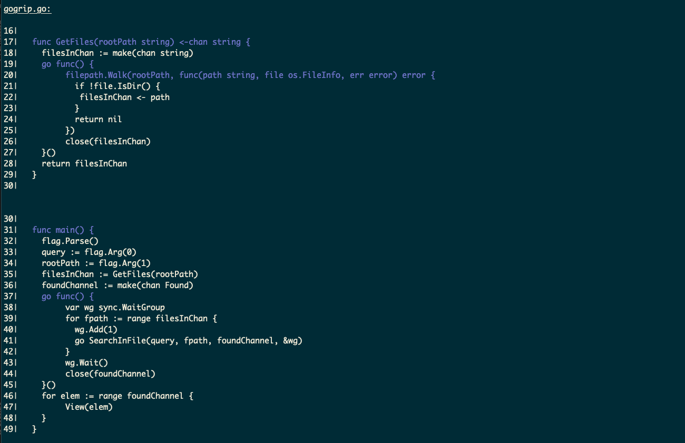

# gogrip

A cli tool similar to grep but it show the entired block of lines around the matched line.

```bash
gogrip "func"  gogrip.go
```


## Installation

first you need in your .bashrc GOPATH as part of your PATH
```bash
export GOPATH=$HOME/go
export PATH=$PATH:$GOPATH/bin
```

Then you can install it with:
```bash
go install .
```